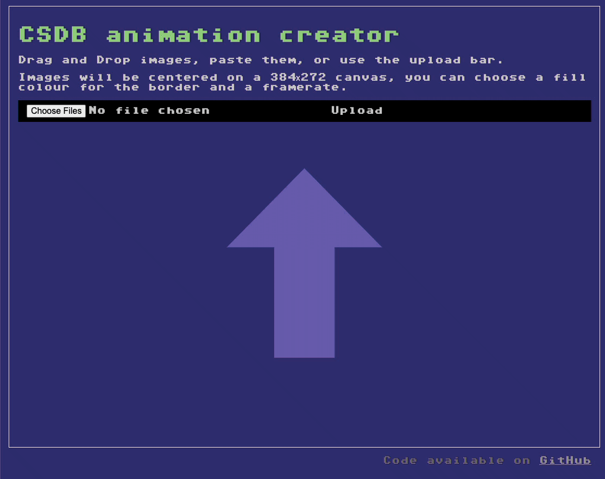

# CSDB screen animation generation 

[CSDB](https://csdb.dk) demands screenshots to be 384 by 272 pixels (including borders) but I found myself working with graphics software that exports 320 by 200. This tool allows you to upload, drag into or copy and paste several images which then will be centered on a canvas of 384x272 and turned into an animated GIF.

You can define the fill colour and how many milliseconds should be in between the different GIF frames.

 
* All code and "design" by Chris Heilmann except for 
* GIF generation using [jsGIF](https://github.com/antimatter15/jsgif) by Kevin Kwok